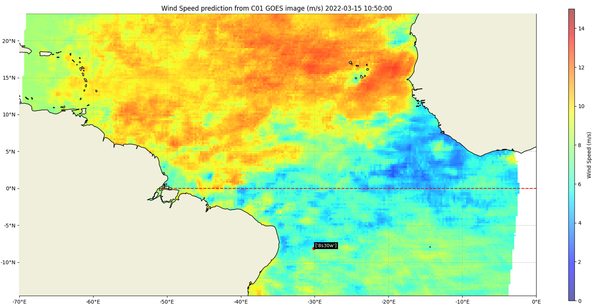

# WindScanGEO

**WindScanGEO** is a deep learning framework developped to detect wind speeds from the images of the *Geostationary Operational Environmental Satellite (GOES)*. It is able to deliver high frequency wind speed predictions (every 10 minutes) at a 25x25km spacial resolution over the ocean. This is useful for any research that looks into daily and small-scale spacial variability and evolution of wind speeds. It is based on a ResNet50 model that is trained daily on scatterometer data which allows inference of the model on the extent of an entire GOES image.

This framework is open-source and has been developped by Y.Loo, Dr. J.Sun, Dr. G.George at the Geoscience and Remote Sensing department and the Intelligent Systems department of the TUDelft

The framework is distributed as a **python package** that is easily usable to train and infer models at any time and location desired by the user. For more information, go to the *"introduction page"*. To directly use the package yourself, go to the *"installation" page*. 