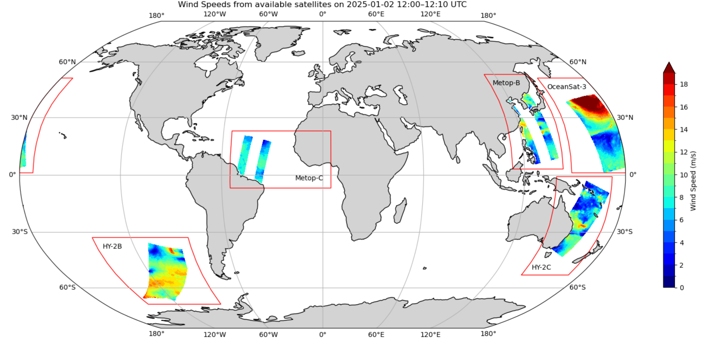
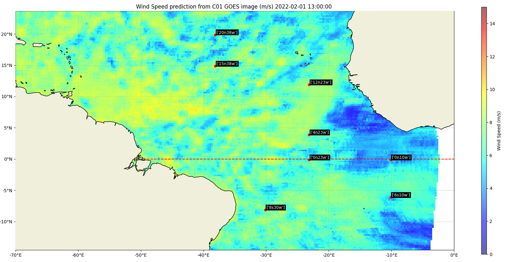

# Introduction

Wind speed is a key variable in weather forecasting ([Sankhala et al., 2025](https://www.sciencedirect.com/science/article/pii/S0273117724010731?casa_token=pdcyInRErvwAAAAA:Gk4MEsp3DpgqFf5Rmtx4JKUmwDfyY3MW5RZJQwmHCA87UXpsoJjqtEOmWmyKc5PNA7BbgJEFkKo)), climate research ([Windmiller, 2024](https://agupubs.onlinelibrary.wiley.com/doi/full/10.1029/2024GL109460)) and wind energy market predictions ([Foley et al., 2012](https://www.sciencedirect.com/science/article/abs/pii/S0960148111002850?via%3Dihub)). Currently, polar-orbiting satellites provide the only means of observing ocean surface wind speeds globally and at scale, with most of these satellites operating in sun-synchronous orbits ([Young et al., 2017](https://journals.ametsoc.org/view/journals/atot/34/6/jtech-d-16-0145.1.xml)), meaning that each satellite passes over the same point on Earth at approximately the same local time each day. Scatterometers are the main sources of polar orbiting wind speed data ([Bentamy et al., 2021](https://www.mdpi.com/2072-4292/13/5/940?utm_source=chatgpt.com)). There are currently 5 operational scatterometers orbiting the Earth (Figure 1). With a maximum of two overpasses per day, we are able to capture at maximum 10 measurements at any point on Earth each day ([Copernicus marine, 2025](https://data.marine.copernicus.eu/product/WIND_GLO_PHY_L3_NRT_012_002/description)). However, these observations are spatially irregular and constrained by the instrument's swath width, which typically ranges from 500 to 1,800 km across ([EUMETSAT, 2024](https://scatterometer.knmi.nl/publications/pdf/osisaf_ss3_atbd.pdf)).

Figure 1. Scatterometer data from all available satellites between 12:00-12:10 UTC (10 minute time interval) on the entire earth (2025-01-02). Red rectangles represent the different satellites : Metop-B ([EUMETSAT](https://space.oscar.wmo.int/satellites/view/metop_b)), Metop-C ([EUMETSAT](https://space.oscar.wmo.int/satellites/view/metop_c)), HY-2B ([NSOAS](https://space.oscar.wmo.int/satellites/view/hy_2b)), HY-2C ([NSOAS](https://space.oscar.wmo.int/satellites/view/hy_2c)), OceanSat-3 ([ISRO](https://space.oscar.wmo.int/satellites/view/oceansat_3_eos_06))

There is a need for increased surface wind measurements, especially over the ocean, where measurements are sparse ([Bourassa et al., 2009).](https://repository.library.noaa.gov/pdfjs/web/viewer.html?file=https://repository.library.noaa.gov/view/noaa/22100/noaa_22100_DS1.pdf#cite.bib208) The approach proposed in this framework to address this gap is to explore the use of geostationary satellites. These have a better spatio-temporal resolution ([Xi et al, 2022](https://www.spiedigitallibrary.org/journals/journal-of-applied-remote-sensing/volume-16/issue-03/037501/Validation-of-geostationary-operational-environmental-satellite-16-advanced-baseline-imager/10.1117/1.JRS.16.037501.full)) but none were designed to directly capture wind speeds.

Geostationary satellites have a fixed orbit. They can take an image of an entire face of the Earth at regular intervals. These satellites can provide data at a 10 minute temporal resolution and can provide up to 144 measurements per day or 48 during daylight ([NOAA, 2025](https://www.star.nesdis.noaa.gov/GOES/)).

Deep learning models have recently proven to be able to find complex patterns in images ([Olaf et al., 2015](https://arxiv.org/abs/1505.04597)). Multi-spectral images provided from geostationary satellites are optimal to be entered in such models ([Chengxin et. al](https://acp.copernicus.org/articles/25/759/2025/)).

A method to derive wind speeds from geostationary data would increase temporal resolution by a factor of 10x and increase the extent of coverage to further than just the swath covered by the scatterometer.

Using supervised learning, we label data to train a model for a specific predictive task ([Chengxin et. al](https://acp.copernicus.org/articles/25/759/2025/)). In our application, scatterometer data serves as ground truth to train a model to infer wind speeds from geostationary satellite images.

---

# Geostationary Operational Environmental Satellite

the Geostationary Operational Environmental Satellite East (GOES-16) is used in this framework to provide the images for wind speed retrieval (further developents of the package could include GOES West and MeteoSat ([EUMETSAT](https://www.eumetsat.int/our-satellites/meteosat-series))). GOES is operated by the National Oceanic and Atmospheric Administration. It can provide a full-disk image in 16 spectral bands contained in the infrared and visible spectrum. The spatial resolution is 0.5-2 km depending on the band chosen. Images are available at 10 minute intervals ([NOAA, 2025](https://www.star.nesdis.noaa.gov/GOES/)).

Figure 2. Geostationary satellite data at 10 minute intervals from the Geostationary Operational Environmental Satellite East (GOES-16 Channel 01([NOAA, 2025](https://www.star.nesdis.noaa.gov/GOES/))

We use four different scatterometer satellites as ground truth for training the model. The first two, Metop-B and Metop-C, are operated by the European Organisation for the Exploitation of Meteorological Satellites ([EUMETSAT](https://space.oscar.wmo.int/satellites/view/metop_b)) and the European Space Agency ([ESA](https://www.esa.int/Applications/Observing_the_Earth/Meteorological_missions/MetOp)). The last two, HY-2B and HY-2C, are operated by the National Satellite Ocean Application Service ([NSOAS](http://www.nsoas.org.cn/eng/item/253.html)) and the China Academy of Space Technology ([CAST](https://www.cast.cn/english/channel/1665)). These four satellites were selected, because they have all been operational for at least 5 years ([WMO, 2025](https://space.oscar.wmo.int/satellites)) and continue to operate today, allowing testing on historical data from recent years.

These 4 satellites are all scatterometers but they differ in the exact instrument configuration used, geophysical model function (CMF) and calibration process ([Wang et al., 2019](https://www.sciencedirect.com/science/article/pii/S0034425719300963?via%3Dihub#bb0010), [Li et al., 2015](https://link.springer.com/article/10.1007/s00343-015-4136-4)). The GMF relates radar backscatter measurements to wind speeds. In our application, we treat all four satellites equally as ground truth sources, under the assumption that incorporating multiple independent sensors reduces potential biases  and improves dataset robustness.

With each satellite orbiting the Earth around twice at any point in space, we can achieve a dataset with 8 measurements per day for any given location. Taking into account that the corresponding geostationary satellite used for training can only provide data during daylight, this brings our scatterometer measurements to 4x daily.

This provides us with a daily dataset of around 50'000 training pairs. The training images are 128x128 pixels padded images from the GOES16 satellite which correspond to the area measured by a single scatterometer pixel (Figure 3).

As a result of the optical view of the GOES16 satellite, pixel count and image geometry varies depending on its location on Earth. Data filtering is applied on the training data to filter out night-time images, as well as images with too few pixels. The images at the edge of the focal view of GOES are also filtered out because they do not provide enough pixels for a good prediction.

---

# Deep Learning Models

The current framework allows the user to use 3 different types of deep learning models.

1. CNN
2. ResNet
3. ViT

The **CNN** is a modular model and the lightest model to run. The images go through 3 layers resulting in 64 features at each step. The kernels used for the convolutions are 3x3 with a stride of 1. Each hyperparameter can be adjusted by the user. A hyperparameter sweep has already been done in order to find the optimal hyperparamters, nevertheless. It is possible that changing the framework and different deployment setups might require a new hyperparameter choice. A training of a model on a single of data takes approx. 10mins on a desktop GPU*.

The **ResNet** model is based on the ResNet50 from @JayPatwardhan on Github ([Link](https://github.com/JayPatwardhan/ResNet-PyTorch/blob/master/ResNet/ResNet.py)). It is based on the foundation paper : "Deep Residual Learning for Image Recognition" by Kaiming He, Xiangyu Zhang, Shaoqing Ren, Jian Sun. This model is more complex than the conventional CNN due to the use of skip connections which allows the model to be much deeper whilst avoiding the vanishing gradient problem. A training of a model on a single of data takes approx. 45mins on a desktop GPU*.

The **ViT** is based on the vision transformer implementation from @Umong Sain ([Link](https://www.kaggle.com/code/umongsain/vision-transformer-from-scratch-pytorch)). Unlike the ResNet and ViT architecture, the ViT uses the more modern transformer architecture which has been used extensively in LLMs. The ViT comes from the foundational paper : " An Image is Worth 16x16 Words: Transformers for Image Recognition at Scale" ([A Kolesnikov et.al](https://arxiv.org/abs/2010.11929)). A training of a model on a single of data takes approx. +1hr on a desktop GPU*.

*tested on a NVIDIA RTX4070x. Time is indicative only, results may vary depending on exact setup.

# Comparison of different Channels of GOES16

The GOES16 satellite captures 16 different channels from visible, near-IR to IR.  The following test results show the MSE of a 10% test dataset that was never seen in training. 16 experiments were done independently, each provided with a daily dataset of a different GOES channel. The model used is a ResNet50 limited to 50 epochs with an early stopping algorithm implemented to avoid overfitting.  The results are sorted in high test MSE to low test MSE (the lower the better). These results show that C01, C09 and C06 are the channels that perform the best in this wind speed prediction task. Channels C11 and C12 present nearly no useful data to predict wind speed and therefore show a high MSE.

C06 **Cloud Particle Size**

"The centralized wavelength for this band is 2.24 µm (micrometers).

The cloud particle size increases as they change from liquid to ice.
This channel helps maximize the apparent difference so we can
distinguish liquid clouds from ice crystal clouds. Small particles
(liquid) appear bright while larger ice crystals appear dark. Also,
similar to the 1.6 µm band, the 2.2 µm band can be useful in determining
 hot spots at night. In fact, this channel is closer to the emitting
energy of fires than channel 5." ([NOAA](https://www.noaa.gov/jetstream/goes_east))

C09 **Mid-Level water vapor**

"The centralized wavelength for this band is 6.9 µm (micrometers).

Unless higher-level clouds obscure the view, this band can view as
low as 500 mb level (about 18,000 feet/5,500 meters). It is used for
mid- and upper-level water vapor tracking, jet stream identification,
hurricane track forecasting, mid-latitude storm forecasting, severe
weather analysis, and mid-level moisture estimation." ([NOAA](https://www.noaa.gov/jetstream/goes_east))

C01 **Blue visible spectrum**

"The centralized wavelength for this band is 0.47 µm (micrometers).

Located in the blue portion of the visible spectrum, it provides
nearly continuous daytime observations of dust, haze, smoke, and clouds.
 It also includes measurements of "aerosol optical depths" that help air
 quality monitoring and tracking. Measurements in the blue band may
provide estimates of visibility as well." ([NOAA](https://www.noaa.gov/jetstream/goes_east))

---

# Using the framework

The framework is modular and can be used to train and predict a wind speed for any day in the past data record that intersects between the operational use of the GOES16 satellite and scatterometer satellites. The channel used for the prediction and the model used can be selected by the user. **For example : 2022-02-01 ResNet50, C01.**

Once a model has been trained on daily data, it can then be used to predict wind speed for any GOES image captured during daylight (temporal resolution : 10 mins).

For each GOES wind speed prediction, buoy data and ERA5 are used as validation to verify the results from the model. See *"validation page"*.
